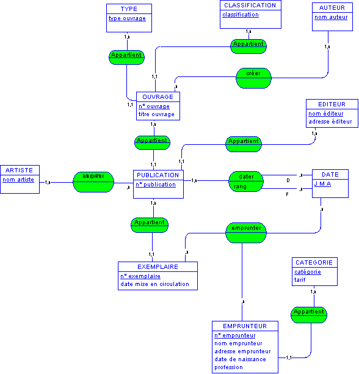
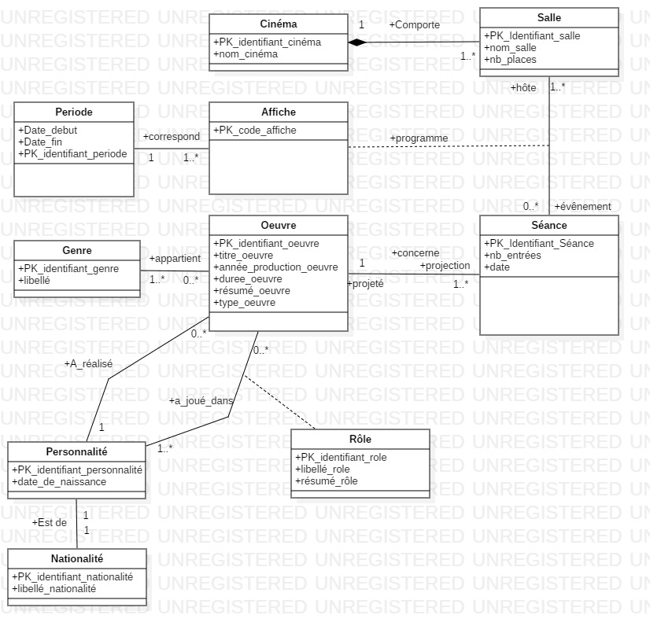

# hello-DBMS
This project is part of Laplateforme curiculum, the goal of this project is to train our ability to manage databases and make efficient requests.
This readme will contain the research and base notions regarding SQL. It will also be split in two with the english version of the readme and the french version.

## English section

### Question 1 : What is a data and what form can it take ?

A data is a piece of information, it can takes countless forms such as a number representing the age of someone, text, a voice recording, a video, electric signals and so on ...
Data are the base on which AI is built, without data to analyze and process there is no AI. Those pieces of informations, within the right context can give very meaningfull insights.

### Question 2 : List and explain the different mesurement criteria regarding data

**Data Quality Measurement Criteria and Explanations:**

1. **Accuracy:**
   - *Definition:* Accuracy measures the proximity between data and reality.
   - *Explanation:* Data should accurately reflect the characteristics and values they represent. Errors can occur during data collection, entry, or processing.

2. **Completeness:**
   - *Definition:* Completeness evaluates the presence of all necessary and expected data.
   - *Explanation:* Data must be complete, without crucial information gaps. Data gaps can lead to biased or incomplete analyses.

3. **Consistency:**
   - *Definition:* Consistency examines the harmonization of data across different sources.
   - *Explanation:* Data should be consistent across different databases and systems. Inconsistencies can lead to errors and contradictions.

4. **Timeliness:**
   - *Definition:* Timeliness measures the temporal relevance of data.
   - *Explanation:* Data should be updated in a timely manner to reflect changes in reality. Outdated data can lead to obsolete analyses.

5. **Precision:**
   - *Definition:* Precision concerns the level of detail or granularity of data.
   - *Explanation:* Data should be sufficiently precise to meet specific analysis needs. Overly aggregated data can mask important trends.

6. **Validity:**
   - *Definition:* Validity evaluates whether data conforms to predefined rules and standards.
   - *Explanation:* Data must adhere to established constraints and rules, avoiding outliers or formatting errors.

7. **Uniformity:**
   - *Definition:* Uniformity examines the standardization of data across different sources.
   - *Explanation:* Data should follow common standards and formats to ensure easy interoperability and eliminate unnecessary divergences.

8. **Integrity:**
   - *Definition:* Integrity measures the reliability and stability of data over time.
   - *Explanation:* Data should remain consistent and reliable even during updates or modifications. Integrity ensures the longevity of information.

The evaluation of data quality often involves a combination of these criteria to ensure reliable and actionable data. Organizations implement data quality management processes to monitor and continuously improve the quality of their data.

### Question 3 : Define and compare the notions of Data Lake, Data Warehouse and Lake House. Illustrate with graphs

**Data Lake:**
A Data Lake is a centralized repository that allows you to store all your structured and unstructured data at any scale. It can store raw, detailed data as well as processed data. The key characteristic of a Data Lake is that it allows you to store data without the need to structure it first, making it suitable for big data and analytics.

**Data Warehouse:**
A Data Warehouse is a structured repository for storing and managing data from various sources. It is optimized for query and analysis. Data Warehouses typically involve the extraction, transformation, and loading (ETL) of data from different sources into a structured schema, making it suitable for business intelligence and reporting.

**Lake House:**
A Lake House is a hybrid approach that combines elements of both Data Lakes and Data Warehouses. It seeks to address the flexibility of Data Lakes and the structured processing capabilities of Data Warehouses. A Lake House often integrates features like schema enforcement and indexing to provide structure to the data in the lake, making it more accessible for analytics.


**Comparison:**

1. **Data Storage:**
   - **Data Lake:** Stores raw and unstructured data.
   - **Data Warehouse:** Stores structured and processed data.
   - **Lake House:** Hybrid approach, storing both raw and structured data.

2. **Data Processing:**
   - **Data Lake:** Allows for flexible and diverse processing, but may require additional processing for analysis.
   - **Data Warehouse:** Optimized for query and analysis with a predefined structure.
   - **Lake House:** Aims to provide both flexibility and optimization for structured processing.

3. **Schema:**
   - **Data Lake:** Schema-on-read; schema is applied when the data is read.
   - **Data Warehouse:** Schema-on-write; data is structured before loading.
   - **Lake House:** Combines schema-on-read and schema-on-write approaches for flexibility and optimization.

4. **Use Cases:**
   - **Data Lake:** Big data analytics, machine learning, and exploratory data analysis.
   - **Data Warehouse:** Business intelligence, reporting, and traditional analytics.
   - **Lake House:** Aims to cover a broad range of use cases by combining features of both.

5. **Performance:**
   - **Data Lake:** May require additional processing for optimal performance.
   - **Data Warehouse:** Optimized for fast query performance.
   - **Lake House:** Strives to provide a balance between flexibility and performance.

In summary, while a Data Lake is suitable for storing large volumes of raw and unstructured data, and a Data Warehouse is optimized for structured processing, a Lake House attempts to offer a middle ground, providing flexibility in storing data while also optimizing it for analytics and queries. The choice between them depends on the specific requirements and use cases of an organization.


### Question 4 : What is a relational database? What is a non-relational database? Provide the difference between the two with examples of applications

**Relational Database:**

A relational database is a type of database that organizes data in the form of tables, where each table consists of rows and columns. Relationships between tables are established using primary and foreign keys. The relational model ensures data integrity and provides a flexible structure to represent complex relationships between entities.

Example of application: Relational database management systems (RDBMS) such as MySQL, PostgreSQL, Oracle Database. These databases are often used in applications where the data structure is clearly defined, such as content management systems, information systems, and enterprise applications.

**Non-Relational Database:**

A non-relational database, also known as NoSQL (Not Only SQL), is a type of database that does not follow the traditional tabular model of relational databases. These databases are designed to handle massive volumes of data with various data models. They offer increased flexibility for data storage and retrieval, making them suitable for specific use cases.

Example of application: MongoDB (document-oriented database), Cassandra (column-oriented database), Redis (key-value database). These databases are often used in applications requiring horizontal scalability, management of unstructured data, and dynamic data models, such as high-traffic web applications, recommendation systems, and IoT applications.

**Differences between Relational and Non-Relational Databases:**

1. **Data Structure:**
   - **Relational:** Data is organized in tables with defined relationships between tables.
   - **Non-Relational:** Data structure can vary, with models such as document, column, key-value, graph, etc.

2. **Schema:**
   - **Relational:** Uses a predefined schema with tables and columns.
   - **Non-Relational:** Often schema-less or with a flexible schema, allowing more flexible data evolution.

3. **Scalability:**
   - **Relational:** Typically scales vertically (adding power to a single machine).
   - **Non-Relational:** Can scale horizontally (adding nodes to a cluster) to handle high loads.

4. **Examples of Applications:**
   - **Relational:** Information systems, CRM (Customer Relationship Management), ERP (Enterprise Resource Planning).
   - **Non-Relational:** Social networks, IoT (Internet of Things) applications, real-time analytics, content management applications.

5. **Flexibility:**
   - **Relational:** Less flexible for changing data structures.
   - **Non-Relational:** More flexible for evolving and dynamic data models.

In summary, the main distinction lies in how data is structured and managed. Relational databases offer a fixed structure with defined relationships, while non-relational databases provide increased flexibility to handle varied data and dynamic data models. The choice between the two depends on the specific requirements of an application.

### Question 5 : Define the notions of Foreign key and Primary key

**Primary Key:**

A primary key is an attribute or a set of attributes in a database table that uniquely identifies each record in that table. In other words, no value in the primary key can be repeated, and it cannot contain null values. The primary key plays a crucial role in data integrity by ensuring the uniqueness of records and facilitating relationships between tables.

Example: In an employee table, the employee identification number (EmployeeID) could be used as the primary key, ensuring that each employee has a unique identifier.

**Foreign Key:**

A foreign key is an attribute in a table that references the primary key of another table. It establishes a relationship between two tables by linking the values of the foreign key to the values of the primary key in a parent-child relationship. Foreign keys are used to maintain referential integrity between tables.

Example: If a "Orders" table has a foreign key referencing the primary key "ClientID" in a "Clients" table, it means that each order is associated with a specific client.

In summary, the primary key uniquely identifies records in a table, while the foreign key establishes links between tables by connecting the primary key of one table to the foreign key of another, facilitating relationships between data.

### Question 6 : What are ACID properties ?

The ACID properties are a set of fundamental characteristics guaranteed by transactional database management systems to ensure the consistency, integrity, and reliability of transactions. The ACID properties are as follows:

1. **Atomicity:**
   - *Definition:* A transaction is a unitary operation that is executed in its entirety or not at all. If any part of the transaction fails, the entire transaction is rolled back to the initial state.

2. **Consistency:**
   - *Definition:* A transaction brings the database from one valid state to another. Before and after the execution of the transaction, the database must adhere to all defined integrity and consistency rules.

3. **Isolation:**
   - *Definition:* Transactions run in isolation from each other, meaning that the changes made by one transaction are not visible to other transactions until the first one is completed.

4. **Durability:**
   - *Definition:* Once a transaction is committed, the changes made to the database are permanent and survive system failures. Even in case of subsequent system failures, the modified data remains intact.

These properties are essential to ensure the reliability and integrity of transactions in database management systems, especially in critical environments where data accuracy and consistency are paramount, such as in banking systems, reservation systems, etc.

### Question 7 : Define the Merise and UML methods. What is their utility in the world of computing? Provide specific use cases with diagrams.

**Merise:**

Merise is a method for designing information systems that was developed in France. It provides a set of concepts, notations, and techniques to model data, processes, and interactions within an information system. Merise uses diagrams such as the MCD (Conceptual Data Model) to model entities and relationships, the MCT (Conceptual Model of Processes) to represent processes, and the MPD (Physical Data Model) to detail data implementation.

**UML (Unified Modeling Language):**

UML is a standardized graphical modeling language used in software engineering to visually represent specifications, designs, and software architectures. UML offers a variety of diagrams, such as class diagrams, sequence diagrams, activity diagrams, etc., to represent different aspects of a software system.

**Utility in the world of computing:**

- **Merise:** Merise is used to design and model information systems, with a particular focus on data and process modeling. It is often used in the development of transactional information systems.

- **UML:** UML is widely used in the field of software engineering to visually represent different aspects of a software system, from initial design to implementation. It is used in the development of object-oriented software.

**Specific use cases with diagrams:**

- **Using Merise:** Suppose we are designing a library management system. We could use Merise to create an MCD representing entities such as Book, Author, and Loan, as well as the relationships between these entities. Here is a simplified example of an MCD for the library using Merise:

  

- **Using UML:** Imagine we are developing an online reservation system for a cinema. We could use UML to create a sequence diagram representing the interaction between the user and the system when making a reservation. Here is a simplified example of a UML sequence diagram for online reservation:

  

These examples illustrate how Merise and UML can be applied in specific contexts to design and model information systems and software.

### Question 8 : Define the SQL language. Provide the most commonly used commands in this language and the different types of joins that can be performed

**SQL (Structured Query Language):**

The SQL (Structured Query Language) is a standardized programming language used to manage and manipulate relational databases. It allows for the definition, querying, updating, and management of databases. SQL is widely used in software development, database administration, and data analysis.

**Most commonly used SQL commands:**

1. **SELECT:** Used to query a database and retrieve data.

   ```sql
   SELECT column1, column2 FROM table WHERE condition;
   ```

2. **INSERT:** Inserts new rows into a table.

   ```sql
   INSERT INTO table (column1, column2) VALUES (value1, value2);
   ```

3. **UPDATE:** Updates existing data in a table.

   ```sql
   UPDATE table SET column1 = value1 WHERE condition;
   ```

4. **DELETE:** Deletes rows from a table.

   ```sql
   DELETE FROM table WHERE condition;
   ```

5. **CREATE:** Creates a new table, database, or other database objects.

   ```sql
   CREATE TABLE table (column1 datatype, column2 datatype);
   ```

6. **ALTER:** Modifies the structure of an existing table.

   ```sql
   ALTER TABLE table ADD column datatype;
   ```

7. **DROP:** Deletes a table, database, or other database objects.

   ```sql
   DROP TABLE table;
   ```

**Most common SQL Joins:**

Joins are used to combine data from two or more tables based on defined relationships.

1. **INNER JOIN:** Returns only the rows that have a match in both tables.

   ```sql
   SELECT * FROM table1 INNER JOIN table2 ON table1.column = table2.column;
   ```

2. **LEFT JOIN (or LEFT OUTER JOIN):** Returns all rows from the left table and the matching rows from the right table.

   ```sql
   SELECT * FROM table1 LEFT JOIN table2 ON table1.column = table2.column;
   ```

3. **RIGHT JOIN (or RIGHT OUTER JOIN):** Returns all rows from the right table and the matching rows from the left table.

   ```sql
   SELECT * FROM table1 RIGHT JOIN table2 ON table1.column = table2.column;
   ```

4. **FULL JOIN (or FULL OUTER JOIN):** Returns all rows when there is a match in either of the two tables.

   ```sql
   SELECT * FROM table1 FULL JOIN table2 ON table1.column = table2.column;
   ```

5. **CROSS JOIN:** Returns the Cartesian product of two tables, i.e., all possible combinations of rows.

   ```sql
   SELECT * FROM table1 CROSS JOIN table2;
   ```

These SQL commands and joins are fundamental for interacting with relational databases and performing complex operations of data querying and manipulation.

## Section Française

### Question 1 : Qu’est ce qu’une donnée ? Sous quelle forme peut-elle se présenter ?

Une donnée est une information ou un morçeau d'information, une donnée peut prendre de nombreuses formes comme un nombre représentant l'âge d'une personne, du texte, un enregistrement vocal ou vidéo, un signal éléctrique...
Les données sont la base de l'intelligence artificielle, sans données à analyser et traiter il n'y a pas d'IA. Ces informations, dans le contexte adéquat peuvent donner des indications très précieuses.

### Question 2 : Donnez et expliquez les critères de mesure de qualité des données

La qualité des données est essentielle pour garantir la fiabilité, la pertinence et l'efficacité des processus décisionnels et des analyses. Pour évaluer la qualité des données, plusieurs critères peuvent être pris en compte. Voici quelques-uns des critères de mesure de qualité des données, accompagnés d'explications :

1. **Exactitude (Accuracy) :**
   - *Définition :* L'exactitude mesure la proximité entre les données et la réalité.
   - *Explication :* Les données doivent refléter correctement les caractéristiques et les valeurs qu'elles représentent. Des erreurs peuvent survenir lors de la collecte, de la saisie ou du traitement des données.

2. **Complétude (Completeness) :**
   - *Définition :* La complétude évalue la présence de toutes les données nécessaires et attendues.
   - *Explication :* Les données doivent être complètes, sans manque d'informations cruciales. Des lacunes dans les données peuvent entraîner des analyses biaisées ou incomplètes.

3. ** Cohérence (Consistency) :**
   - *Définition :* La cohérence examine l'harmonisation des données à travers différentes sources.
   - *Explication :* Les données doivent être cohérentes entre les différentes bases de données et les différents systèmes. Les incohérences peuvent entraîner des erreurs et des contradictions.

4. **Actualité (Timeliness) :**
   - *Définition :* L'actualité mesure la pertinence temporelle des données.
   - *Explication :* Les données doivent être mises à jour en temps opportun pour refléter les changements dans la réalité. Des données périmées peuvent conduire à des analyses obsolètes.

5. **Précision (Precision) :**
   - *Définition :* La précision concerne le niveau de détail ou de granularité des données.
   - *Explication :* Les données doivent être suffisamment précises pour répondre aux besoins spécifiques de l'analyse. Des données trop agrégées peuvent masquer des tendances importantes.

6. **Validité (Validity) :**
   - *Définition :* La validité évalue si les données sont conformes aux règles et aux normes prédéfinies.
   - *Explication :* Les données doivent respecter les contraintes et les règles établies, évitant ainsi les valeurs aberrantes ou les erreurs de format.

7. **Uniformité (Uniformity) :**
   - *Définition :* L'uniformité examine la standardisation des données à travers différentes sources.
   - *Explication :* Les données doivent suivre des normes et des formats communs pour assurer une interopérabilité facile et éliminer les divergences inutiles.

8. **Intégrité (Integrity) :**
   - *Définition :* L'intégrité mesure la fiabilité et la stabilité des données au fil du temps.
   - *Explication :* Les données doivent rester cohérentes et fiables même lors de mises à jour ou de modifications. L'intégrité garantit la pérennité des informations.

L'évaluation de la qualité des données implique souvent une combinaison de ces critères pour garantir des données fiables et exploitables. Les organisations mettent en place des processus de gestion de la qualité des données pour surveiller et améliorer continuellement la qualité de leurs données.

### Question 3 Définissez et comparez les notions de Data Lake, Data Warehouse et Lake House. Illustrez les différences à l’aide de schémas.

**Data Lake :**
Un Data Lake est un référentiel centralisé qui vous permet de stocker toutes vos données structurées et non structurées à n'importe quelle échelle. Il peut stocker des données brutes et détaillées ainsi que des données traitées. La caractéristique clé d'un Data Lake est qu'il vous permet de stocker des données sans avoir besoin de les structurer au préalable, ce qui le rend adapté aux big data et à l'analyse.

**Entrepôt de données (Data Warehouse) :**
Un entrepôt de données est un référentiel structuré pour stocker et gérer des données de diverses sources. Il est optimisé pour les requêtes et l'analyse. Les entrepôts de données impliquent généralement l'extraction, la transformation et le chargement (ETL) des données de différentes sources dans un schéma structuré, ce qui le rend adapté à l'informatique décisionnelle et aux rapports.

**Lake House :**
Un Lake House est une approche hybride qui combine des éléments de Data Lakes et d'entrepôts de données. Il cherche à concilier la flexibilité des Data Lakes et les capacités de traitement structuré des entrepôts de données. Un Lake House intègre souvent des fonctionnalités telles que l'application de schémas et l'indexation pour donner une structure aux données du lac, les rendant ainsi plus accessibles pour l'analyse.


**Comparaison :**

1. **Stockage des données :**
   - **Data Lake :** Stocke des données brutes et non structurées.
   - **Entrepôt de données :** Stocke des données structurées et traitées.
   - **Lake House :** Approche hybride, stockant à la fois des données brutes et structurées.

2. **Traitement des données :**
   - **Data Lake :** Permet un traitement flexible et diversifié, mais peut nécessiter un traitement supplémentaire pour l'analyse.
   - **Entrepôt de données :** Optimisé pour les requêtes et l'analyse avec une structure prédéfinie.
   - **Lake House :** Vise à fournir à la fois la flexibilité et l'optimisation pour le traitement structuré.

3. **Schéma :**
   - **Data Lake :** Schéma à la lecture ; le schéma est appliqué lorsque les données sont lues.
   - **Entrepôt de données :** Schéma à l'écriture ; les données sont structurées avant le chargement.
   - **Lake House :** Combine les approches de schéma à la lecture et à l'écriture pour la flexibilité et l'optimisation.

4. **Cas d'utilisation :**
   - **Data Lake :** Analyse de données massives, apprentissage automatique et analyse exploratoire des données.
   - **Entrepôt de données :** Informatique décisionnelle, rapports et analyses traditionnelles.
   - **Lake House :** Vise à couvrir un large éventail de cas d'utilisation en combinant des fonctionnalités des deux.

5. **Performance :**
   - **Data Lake :** Peut nécessiter un traitement supplémentaire pour des performances optimales.
   - **Entrepôt de données :** Optimisé pour des performances de requête rapides.
   - **Lake House :** S'efforce de fournir un équilibre entre la flexibilité et les performances.

En résumé, tandis qu'un Data Lake convient au stockage de grandes quantités de données brutes et non structurées, et qu'un entrepôt de données est optimisé pour le traitement structuré, un Lake House tente d'offrir un terrain d'entente, fournissant de la flexibilité pour le stockage des données tout en les optimisant pour l'analyse. Le choix entre eux dépend des besoins spécifiques et des cas d'utilisation d'une organisation.


### Question 4 : Qu’est ce qu’une base de données relationnelle ? Qu’est ce qu’une base de données non relationnelle ? Donnez la différence entre les deux avec des exemples d’applications.

**Base de données relationnelle :**

Une base de données relationnelle est un type de base de données qui organise les données sous forme de tables, où chaque table est composée de lignes et de colonnes. Les relations entre les tables sont établies en utilisant des clés primaires et étrangères. Le modèle relationnel permet de garantir l'intégrité des données et offre une structure flexible pour représenter les relations complexes entre les entités.

Exemple d'application : Systèmes de gestion de bases de données relationnelles (SGBDR) tels que MySQL, PostgreSQL, Oracle Database. Ces bases de données sont souvent utilisées dans les applications où la structure des données est clairement définie, comme les systèmes de gestion de contenu, les systèmes d'information, et les applications d'entreprise.

**Base de données non relationnelle :**

Une base de données non relationnelle, également appelée NoSQL (Not Only SQL), est un type de base de données qui ne suit pas le modèle tabulaire traditionnel des bases de données relationnelles. Ces bases de données sont conçues pour gérer des volumes massifs de données avec des modèles de données variés. Elles offrent une flexibilité accrue pour le stockage et la récupération de données, ce qui les rend adaptées à des cas d'utilisation spécifiques.

Exemple d'application : MongoDB (base de données orientée document), Cassandra (base de données orientée colonne), Redis (base de données clé-valeur). Ces bases de données sont souvent utilisées dans des applications nécessitant une évolutivité horizontale, une gestion de données non structurées, et des modèles de données dynamiques, comme les applications Web à fort trafic, les systèmes de recommandation, et les applications IoT.

**Différences entre bases de données relationnelles et non relationnelles :**

1. **Structure des données :**
   - **Relationnelle :** Les données sont organisées sous forme de tables avec des relations définies entre les tables.
   - **Non relationnelle :** La structure des données peut varier, avec des modèles tels que document, colonne, clé-valeur, graphe, etc.

2. **Schéma :**
   - **Relationnelle :** Utilise un schéma prédéfini avec des tables et des colonnes.
   - **Non relationnelle :** Souvent sans schéma rigide, permettant une évolutivité plus flexible des données.

3. **Scalabilité :**
   - **Relationnelle :** Évolue généralement en vertical (ajout de puissance à une seule machine).
   - **Non relationnelle :** Peut évoluer en horizontal (ajout de nœuds à un cluster) pour gérer des charges importantes.

4. **Exemples d'applications :**
   - **Relationnelle :** Systèmes d'information, CRM (Customer Relationship Management), ERP (Enterprise Resource Planning).
   - **Non relationnelle :** Réseaux sociaux, applications IoT (Internet of Things), analyses en temps réel, applications de gestion de contenu.

5. **Flexibilité :**
   - **Relationnelle :** Moins flexible pour les structures de données changeantes.
   - **Non relationnelle :** Plus flexible pour les modèles de données évolutifs et dynamiques.

En résumé, la principale distinction réside dans la façon dont les données sont structurées et gérées. Les bases de données relationnelles offrent une structure fixe avec des relations définies, tandis que les bases de données non relationnelles offrent une flexibilité accrue pour gérer des données variées et des modèles de données dynamiques. Le choix entre les deux dépend des exigences spécifiques d'une application.

### Question 5 : Définissez les notions de clé étrangère et clé primaire.

**Clé primaire (Primary Key) :**

Une clé primaire est un attribut ou un ensemble d'attributs dans une table de base de données qui identifie de manière unique chaque enregistrement de cette table. En d'autres termes, aucune valeur dans la clé primaire ne peut être répétée, et elle ne peut pas contenir de valeurs nulles. La clé primaire joue un rôle essentiel dans l'intégrité des données en garantissant l'unicité des enregistrements et en facilitant les relations entre les tables.

Exemple : Dans une table d'employés, le numéro d'identification de l'employé (EmployeeID) pourrait être utilisé comme clé primaire, assurant ainsi que chaque employé a un identifiant unique.

**Clé étrangère (Foreign Key) :**

Une clé étrangère est un attribut dans une table qui fait référence à la clé primaire d'une autre table. Elle établit une relation entre deux tables en reliant les valeurs de la clé étrangère aux valeurs de la clé primaire dans une relation parent-enfant. Les clés étrangères sont utilisées pour maintenir l'intégrité référentielle entre les tables.

Exemple : Si une table "Commandes" a une clé étrangère qui fait référence à la clé primaire "ClientID" dans une table "Clients", cela signifie que chaque commande est associée à un client spécifique.

En résumé, la clé primaire identifie de manière unique les enregistrements dans une table, tandis que la clé étrangère établit des liens entre les tables en reliant la clé primaire d'une table à la clé étrangère d'une autre, facilitant ainsi les relations entre les données.

### Question 6 :  Quelles sont les propriétés ACID ?

Les propriétés ACID sont un ensemble de caractéristiques fondamentales garanties par les systèmes de gestion de bases de données transactionnelles pour assurer la cohérence, l'intégrité et la fiabilité des transactions. Les propriétés ACID sont les suivantes :

1. **Atomicité (Atomicity) :**
   - *Définition :* Une transaction est une opération unitaire qui est exécutée dans son intégralité ou pas du tout. Si une partie de la transaction échoue, l'ensemble de la transaction est annulé (rollback) pour revenir à l'état initial.

2. **Cohérence (Consistency) :**
   - *Définition :* Une transaction ramène la base de données d'un état valide à un autre. Avant et après l'exécution de la transaction, la base de données doit respecter toutes les règles d'intégrité et de cohérence définies.

3. **Isolation (Isolation) :**
   - *Définition :* Les transactions s'exécutent de manière isolée les unes par rapport aux autres, ce qui signifie que les modifications apportées par une transaction ne sont pas visibles par d'autres transactions tant que la première n'est pas terminée.

4. **Durabilité (Durability) :**
   - *Définition :* Une fois qu'une transaction est confirmée (commit), les modifications apportées à la base de données sont permanentes et survivent aux pannes du système. Même en cas de défaillance ultérieure, les données modifiées restent intactes.

Ces propriétés sont essentielles pour garantir la fiabilité et l'intégrité des transactions dans les systèmes de gestion de bases de données, en particulier dans des environnements critiques où la précision et la cohérence des données sont primordiales, tels que les systèmes bancaires, les systèmes de réservation, etc.

### Question 7 : Définissez les méthodes Merise et UML. Quelles sont leur utilité dans le monde de l’informatique ? Donnez des cas précis d’utilisation avec des schémas.

**Merise :**

Merise est une méthode de conception de systèmes d'information qui a été développée en France. Elle fournit un ensemble de concepts, de notations et de techniques pour modéliser les données, les traitements et les interactions au sein d'un système d'information. Merise utilise des diagrammes comme le MCD (Modèle Conceptuel de Données) pour modéliser les entités et les relations, le MCT (Modèle Conceptuel des Traitements) pour représenter les processus, et le MPD (Modèle Physique de Données) pour détailler l'implémentation des données.

**UML (Unified Modeling Language) :**

UML est un langage de modélisation graphique standardisé utilisé dans le domaine du génie logiciel pour représenter visuellement les spécifications, les conceptions et les architectures logicielles. UML offre une variété de diagrammes, tels que les diagrammes de classes, de séquence, d'activités, etc., pour représenter différents aspects d'un système logiciel.

**Utilité dans le monde de l'informatique :**

- **Merise :** Merise est utilisé pour concevoir et modéliser des systèmes d'information, en mettant particulièrement l'accent sur la modélisation des données et des processus. Il est souvent utilisé dans le développement de systèmes d'information transactionnels.

- **UML :** UML est largement utilisé dans le domaine du génie logiciel pour représenter visuellement les différents aspects d'un système logiciel, de la conception initiale à l'implémentation. Il est utilisé dans le développement de logiciels orientés objet.

**Cas précis d'utilisation avec des schémas :**

- **Utilisation de Merise :** Supposons que nous concevions un système de gestion d'une bibliothèque. Nous pourrions utiliser Merise pour créer un MCD représentant les entités telles que Livre, Auteur, et Emprunt, ainsi que les relations entre ces entités. Voici un exemple simplifié de MCD pour la bibliothèque avec Merise :

  

- **Utilisation d'UML :** Imaginons que nous développons un système de réservation en ligne pour un cinéma. Nous pourrions utiliser UML pour créer un diagramme de séquence représentant l'interaction entre l'utilisateur et le système lorsqu'il effectue une réservation. Voici un exemple simplifié de diagramme de séquence UML pour la réservation en ligne :

  

Ces exemples illustrent comment Merise et UML peuvent être appliqués dans des contextes spécifiques pour concevoir et modéliser des systèmes d'information et des logiciels.

### Question 8 : Définissez le langage SQL. Donnez les commandes les plus utilisées de ce langage et les différentes jointures qu’il est possible de faire.

**SQL (Structured Query Language) :**

Le langage SQL (Structured Query Language) est un langage de programmation standardisé utilisé pour gérer et manipuler des bases de données relationnelles. Il permet de définir, interroger, mettre à jour et gérer des bases de données. SQL est largement utilisé dans le développement de logiciels, l'administration de bases de données et l'analyse de données.

**Commandes SQL les plus utilisées :**

1. **SELECT :** Utilisée pour interroger une base de données et récupérer des données.

   ```sql
   SELECT column1, column2 FROM table WHERE condition;
   ```

2. **INSERT :** Insère de nouvelles lignes dans une table.

   ```sql
   INSERT INTO table (column1, column2) VALUES (value1, value2);
   ```

3. **UPDATE :** Met à jour les données existantes dans une table.

   ```sql
   UPDATE table SET column1 = value1 WHERE condition;
   ```

4. **DELETE :** Supprime des lignes d'une table.

   ```sql
   DELETE FROM table WHERE condition;
   ```

5. **CREATE :** Crée une nouvelle table, une base de données ou d'autres objets de base de données.

   ```sql
   CREATE TABLE table (column1 datatype, column2 datatype);
   ```

6. **ALTER :** Modifie la structure d'une table existante.

   ```sql
   ALTER TABLE table ADD column datatype;
   ```

7. **DROP :** Supprime une table, une base de données ou d'autres objets de base de données.

   ```sql
   DROP TABLE table;
   ```

**Jointures SQL les plus courantes :**

Les jointures sont utilisées pour combiner des données de deux ou plusieurs tables en fonction des relations définies entre elles.

1. **INNER JOIN :** Retourne uniquement les lignes ayant une correspondance dans les deux tables.

   ```sql
   SELECT * FROM table1 INNER JOIN table2 ON table1.column = table2.column;
   ```

2. **LEFT JOIN (ou LEFT OUTER JOIN) :** Retourne toutes les lignes de la table de gauche et les lignes correspondantes de la table de droite.

   ```sql
   SELECT * FROM table1 LEFT JOIN table2 ON table1.column = table2.column;
   ```

3. **RIGHT JOIN (ou RIGHT OUTER JOIN) :** Retourne toutes les lignes de la table de droite et les lignes correspondantes de la table de gauche.

   ```sql
   SELECT * FROM table1 RIGHT JOIN table2 ON table1.column = table2.column;
   ```

4. **FULL JOIN (ou FULL OUTER JOIN) :** Retourne toutes les lignes lorsque qu'il y a une correspondance dans une des deux tables.

   ```sql
   SELECT * FROM table1 FULL JOIN table2 ON table1.column = table2.column;
   ```

5. **CROSS JOIN :** Retourne le produit cartésien de deux tables, c'est-à-dire toutes les combinaisons possibles de lignes.

   ```sql
   SELECT * FROM table1 CROSS JOIN table2;
   ```

Ces commandes SQL et jointures sont fondamentales pour interagir avec les bases de données relationnelles et effectuer des opérations complexes d'interrogation et de manipulation de données.